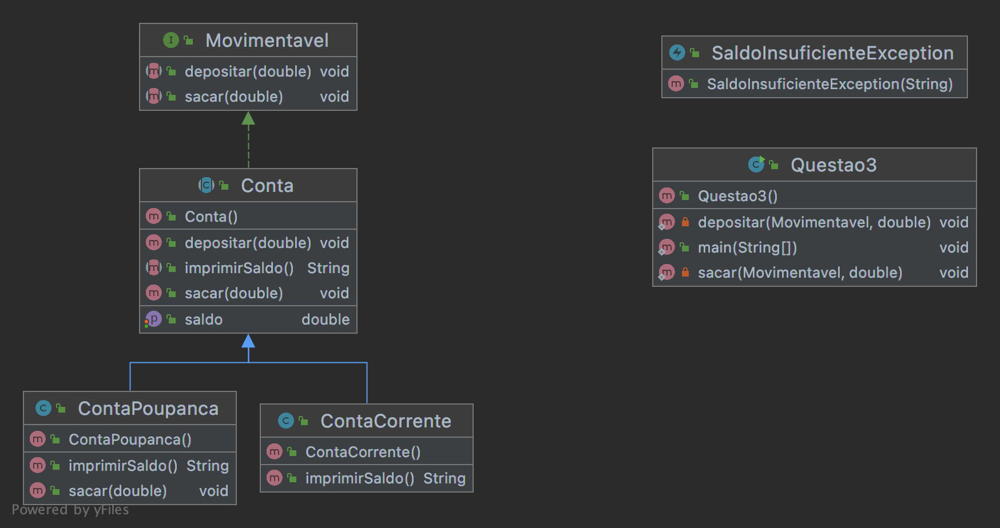

3. (2,5 Pontos) Descreva um problema e projete uma solução de tal modo que contenha:
   
Importante: A descrição do problema é um texto livre não precisa ser muito grande. 
Na implementação precisa apenas ter a estrutura da classe sem implementação em si. 
Mas todo projeto deve compilar.

-    (0,5 pontos) Superclasse abstrata
-    (0,5 pontos) Interface
-    (0,5 pontos) Duas Subclasses herdando de uma superclasse e implementando uma interface criada por
   você
-    (0,5 pontos) Tratamento de exceção
-    (0,5 pontos) Classe de teste que instancie as duas subclasses e mostre um exemplo de polimorfismo.

# Problema:

Fornecer um modelo de domínio para bancos 
que possua contas genéricas e 
permita ao banco implementar diversos tipos específicos de contas 
podendo herdar características genéricas.

# Solucao:

